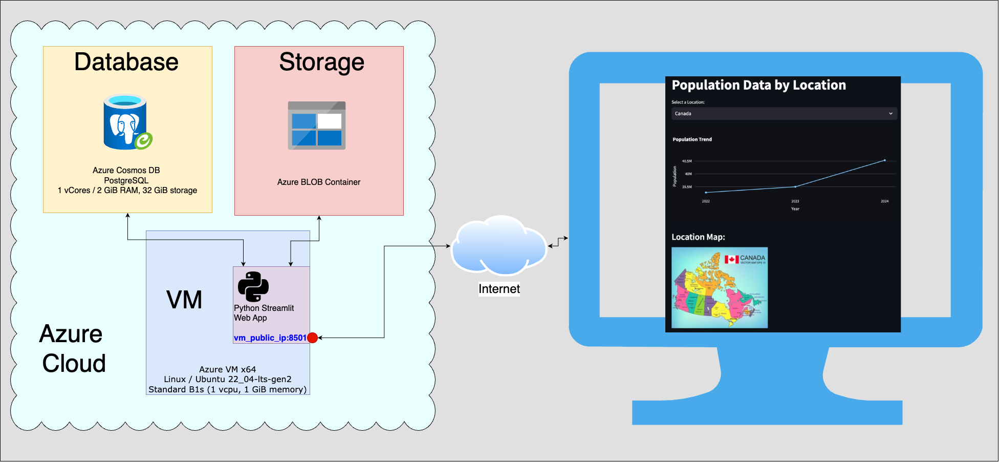
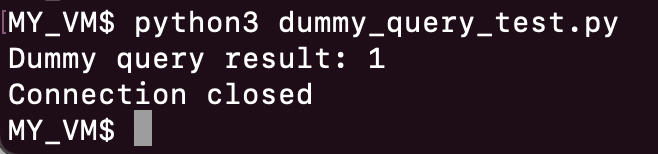
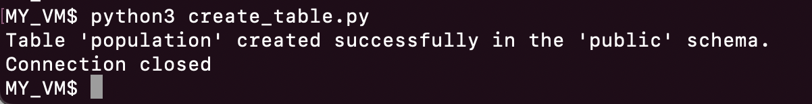
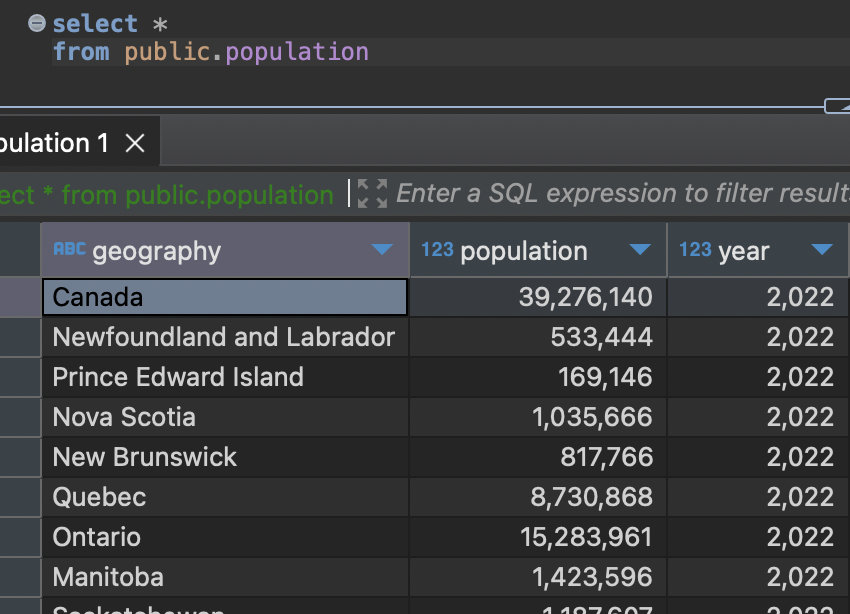

# cloud_app

## Summary
This repository is intended to deploy a web application hosted in a Cloud VM which connects to a Database and a Storage service. The infrastructure was deployed in Azure; however, it can be replicated in other clouds by changing the connection libraries/parameters. All the dependencies are in the *install_reqs.sh* and *requirements.txt* files. The infrastructure's topology is shown below.



It is important to mention that the login credentials for the database and storage are stored in the environment variables of the machine, thus they are not shared through this repository. Moreover, this deployment is focused on quick testing, consequently, further security concerns such as secure SSL connections should be covered for a production environment as they were not considered for this particular case.

## Resources Deployment in Azure
### Virtual Machine: Azure VM
Deploy an Azure VM, Linux / Ubuntu 22_04-lts-gen2, Standard B1s (1 vcpu, 1 GiB memory). In this case, it was intended to be the cheapest as possible. It is also relevant to consider:
* Enabling and testing ssh access to proceed with the implementation of the web app
* Open inbound/outbound 8501 ports for the web application to be accessed

## Database: Azure Cosmos DB free trial (30 days)
Deploy a postgres database with the minimal configurations: Burstable, 1 vCores / 2 GiB RAM, 32 GiB storage. It is crucial to:
* Take note of the host identification string, database name, username, password and port. This is essential to ensure the connection works.
* Enable external connections from at least the public IP of the azure VM. It is also recommended to add your local IP address, then the connection to the database can be tested with a local open-source software such as DBeaver.

## Storage
Create an Azure storage account and test that files can be uploaded to the Blob Container in the Storage Browser blade. It is also relevant to check if public access is allowed.

## Application deployment
### VM: Initial configuration
Log into the VM using ssh and firstly execute ```sudo apt update -y```. Afterwards, clone this repository using ```git clone <this_repository_url>``` or using your preferred method.

After the repository is cloned, the file *install_reqs.sh* can be accessed and there are two options to proceed with the initialization:
* Execute the commands one-by-one, and for the ```export``` commands just change the variables' values in correspondence to your **Database** and **Storage** credentials.
* Edit the credentials in the *install_reqs.sh* file and execute ```./install_reqs.sh```

Once the initialization is completed, the required libraries are installed and the credential values declared. Hence, the connection VM->database can be tested by using ```python3 dummy_query_test.py```. The resoul should be as the one shown below: <br/>


### VM/Database: Insert information to table
Now that the access VM->Database was ensured, the next step is to insert the data that will be used by the application to show to the end user. Proceed to execute ```python3 create_table.py```, the result should be as shown below:<br/>


Additionally, if the database connection was successfully configured from a local machine, the data can also queried by a database client:<br/>


### Storage
